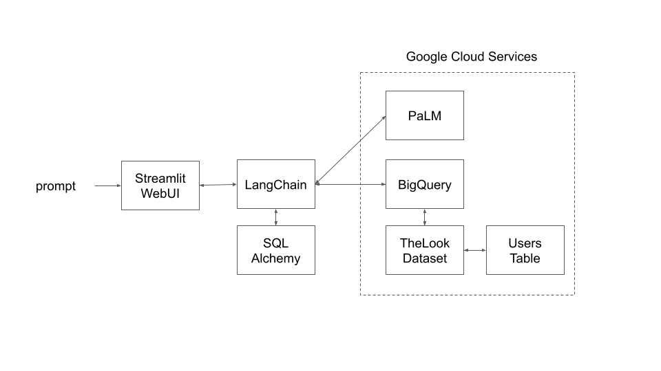

# Google PaLM on BigQuery with LangChain

This project intends to provide a quick way to integrate **PaLM** with **BigQuery** in Python, using **SQLAlchemy** and **LangChain** to glue together the pieces. Added Streamlit for a WebUI. This is in no way a production ready artefact, it rather provides a proof of concept for testing purposes.

The inception of this project was to evaluate if BigQuery could be interrogated using an LLM. The results were rather satisfying, hence the publication. While not provided here, the integration with **ChatGPT** worked as well and can be switched with PaLM easily. 

## Architecture Design



## Components

**PaLM 2** is the latest LLM provided by Google as a cloud service that is quite performant and easy to access through [API](https://developers.generativeai.google/api/python/google/generativeai) using Python. Note that at the moment writing this, PaLM is not widely available in Europe and you may need to access it through a server/services in the US. 

[BigQuery](https://cloud.google.com/bigquery/docs/introduction) is a powerful managed DataWarehouse that provides an out of the box and serverless analytical database. Users often use it to store vast amounts of Data. In this example, we have used the following public and free [Thelook](https://console.cloud.google.com/bigquery/analytics-hub/exchanges;cameo=analyticshub;pageName=listing-detail;pageResource=1057666841514.us.google_cloud_public_datasets_17e74966199.thelook_ecommerce) Dataset.

[LangChain](https://python.langchain.com/docs/get_started/introduction) provides an OSS suite of building blocks to chain LLM oriented tasks with reasoning like database queries, math, document loaders, vector dbs or parsers.

[SQL Alchemy](https://www.sqlalchemy.org/) is a Python toolkit to provide an abstract layer to many popular databases.

[Streamlit](https://blog.streamlit.io/langchain-tutorial-1-build-an-llm-powered-app-in-18-lines-of-code/) is a lighweight WebUI wrapper for Python.

## Setup

### Prerequisites
In order to launch the script you will need the following :
- A working [Python 3](https://docs.python.org/3/using/unix.html#getting-and-installing-the-latest-version-of-python) environment
- Install dependencies using pip
- A Google [PaLM API key](https://developers.generativeai.google/tutorials/setup)
- A [service account](https://cloud.google.com/iam/docs/service-account-overview) on Google Cloud with [BigQuery Data Viewer](https://cloud.google.com/bigquery/docs/access-control-basic-roles)rights and download the [JSON key file](https://cloud.google.com/iam/docs/keys-create-delete).
- [BigQuery API](https://console.cloud.google.com/marketplace/product/google/bigquery.googleapis.com) needs to be activated.

### Install dependencies

To install the dependencies, you will need to run the following command
```
pip install langchain openai chromadb tiktoken tabulate sqlalchemy sqlalchemy-bigquery google-cloud-bigquery google-generativeai google-cloud-bigquery-storage streamlit
```

### Set variables
The following variables need to be set in the `launcher-PaLM.py` script before execution
```
service_account_file = "your_sa_account_key_file.json"
os.environ['GOOGLE_API_KEY'] = 'your_palm_api_key'
project = "your_project_id" 
dataset = "your_dataset" # Defined when you imported TheLook Dataset
table = "you_table"
```
Notes
The JSON service account key file should be accessible to your script.
The variable `your_project_id` can be found [here](https://console.cloud.google.com/home/dashboard). The variable `your_dataset` is defined when you import TheLook dataset from AnalyticsHub. You can set `your_table` to the `events` table from TheLook.

### Running the script
You can run the script using the following command
```
streamlit run launcher-PaLM.py
```

Example output


## Comments
One great features of SQL Alchemy with LangChain is that you do not need to setup a schema as it is created on the fly.

The `temperature` can be adjusted to throttle the "creativity" of your LLM. The `top_k` can be adjusted according to the token size accepted by your API.

You can add a UI easily with Gradio or Streamlit on top of your project.